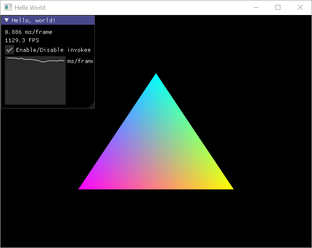
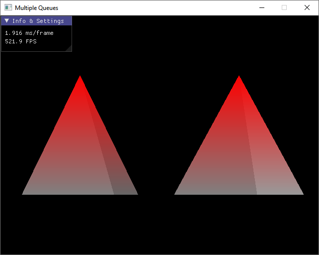
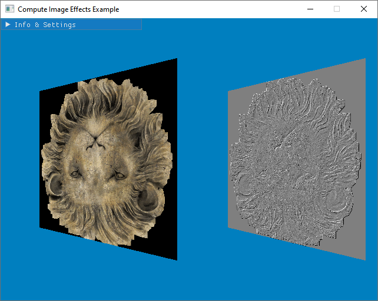
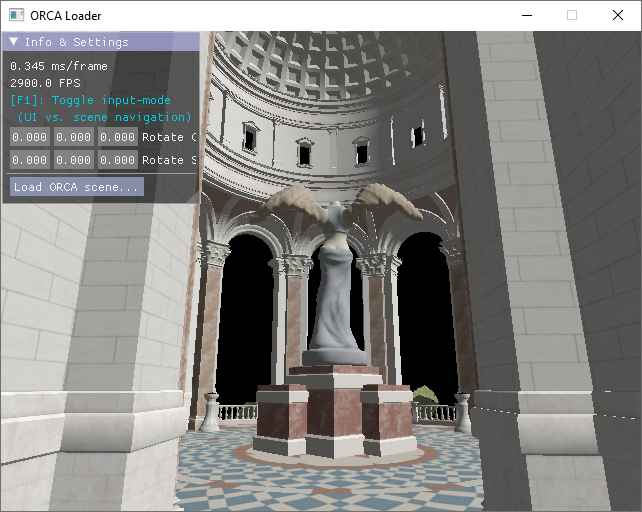
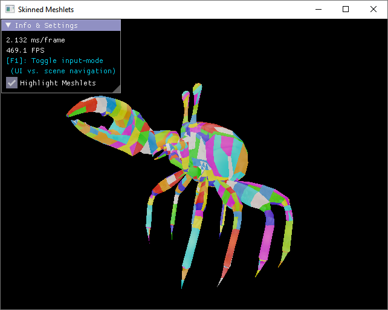
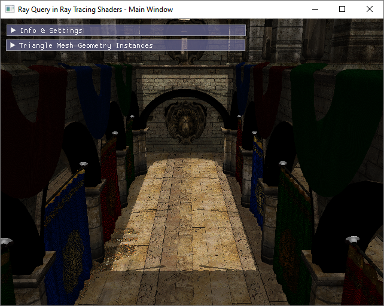
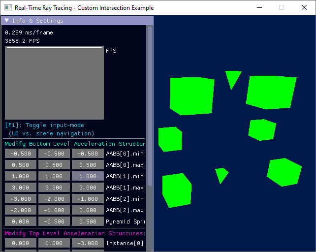
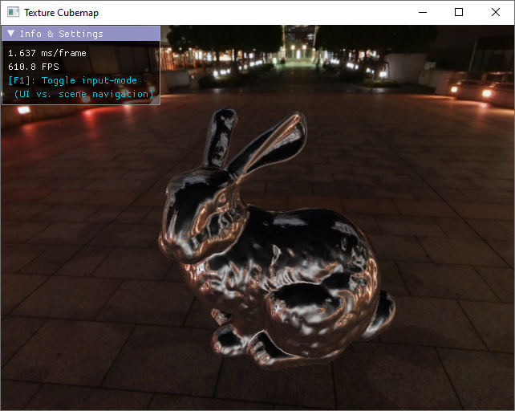

# Auto-Vk-Toolkit v0.98

*Auto-Vk-Toolkit* (formerly "Gears-Vk") is a framework for the Vulkan graphics API, implemented in modern C++.
It aims to hit the sweet spot between programmer-convenience and efficiency while still supporting full Vulkan functionality.
To achieve this goal, this framework uses [*Auto-Vk*](https://github.com/cg-tuwien/Auto-Vk), a convenience and productivity layer atop [Vulkan-Hpp](https://github.com/KhronosGroup/Vulkan-Hpp).

_Auto-Vk-Toolkit_ has been successfully used for rapid prototyping, research (e.g., [Conservative Meshlet Bounds for Robust Culling of Skinned Meshes](https://www.cg.tuwien.ac.at/research/publications/2021/unterguggenberger-2021-msh/)), and teaching (e.g., [Algorithms for Real-Time Rendering](https://www.cg.tuwien.ac.at/courses/ARTR)). The following image showcases some work that has been developed using it (from left to right): Usage in an advanced graphics course for teaching modern low-level GPU concepts; post-processing graphics effects; division of meshes into meshlets, and rendering them with fine-grained view-frustum and backface culling; real-time ray traced shadows and reflections. 

Some of its highlight-features (besides the awesome features of [_Auto-Vk_](https://github.com/cg-tuwien/Auto-Vk)) include:
- Window management and input handling through [GLFW](https://www.glfw.org/).
- Render loop framework with `update()` and `render()` callbacks at varying or fixed update times.
- Powerful _Auto-Vk_-`avk::root` implementation, with swap chain handling and automatic resource lifetime management.
- Versatile [updater](./docs/updater.md) which enables swapchain recreation.
- In combination with a powerful [_Post Build Helper_](./visual_studio/) tool (Windows-only), the [updater](./docs/updater.md) enables shader hot reloading.
- Model loading of a variety of 3D scenes with the help of [assimp](https://github.com/assimp/assimp).
- Loading of `.fscene` files from the [ORCA: Open Research Content Archive](https://developer.nvidia.com/orca).
- Loading of a multitude of image formats, including cube maps.
- Versatile [serializer](./docs/serializer.md) support which allows to serialize Vulkan resources such as `avk:buffer` or `avk::image` instances, and also custom types; based on [cereal](https://github.com/USCiLab/cereal).
- [User interface](./docs/ImGui.md) support through [ImGui](https://github.com/ocornut/imgui) with support for displaying textures in the UI.
- Support for real-time ray tracing (RTX) and building of acceleration structures through [_Auto-Vk_](https://github.com/cg-tuwien/Auto-Vk)
- Support for dividing meshes into [meshlets](./docs/meshlets.md) which can be rendered with task and mesh shaders.

# Installation

*Auto-Vk-Toolkit* is ready to go with Visual Studio or CMake. If your system meets the system requirements, everything is set up to build an run right out of the box. E.g., for Visual Studio, open [`visual_studio/auto_vk_toolkit.sln`](./visual_studio/), set one of the example projects as startup project, build and run!

*Note:* At the first run, the _Post Build Helper_ tool is being built. Watch Visual Studio's "Output" tab for status messages and possible instructions.

## Visual Studio 2019 or 2022
A preconfigured project setup is provided for Visual Studio 2019 on Windows. The projects can be automatically converted to Visual Studio 2022.

Requirements:
* Windows 10 or 11
* Visual Studio 2019 or 2022 with a Windows 10 or 11 SDK installed (For detailed information about project setup and resource management please refer to [`visual_studio/README.md`](./visual_studio/README.md).)
* A [Vulkan SDK from LunarG](https://vulkan.lunarg.com/sdk/home), optimally Vulkan SDK 1.2.141.0 or newer.          
  Latest stable and tested version: Vulkan SDK 1.3.216.0

Setup and build instructions:
* Clone this repository
* Execute a `git submodule update --init` to pull the [_Auto-Vk_](https://github.com/cg-tuwien/Auto-Vk) framework which is added as a submodule under `auto_vk`
* Open the Visual Studio solution file [`visual_studio/auto_vk_toolkit.sln`](./visual_studio/), and build the solution
* During building, you'll recognize messages from the _Post Build Helper_ tool in Visual Studio's `Output`-tab, some popup messages, and an icon in the system tray. Please have a look at section [Resource Mangement and the Post Build Helper](#resource-mangement-and-the-post-build-helper) for additional information.
* Several example applications are available in the solution file. Set one of them as startup project, and run.

Set up your own project:
* To add _Auto-Vk-Toolkit_ to one of your custom repositories, you might want to add it as a GIT submodule. You could execute `git submodule add https://github.com/cg-tuwien/Auto-Vk-Toolkit.git auto_vk_toolkit` to add _Auto-Vk-Toolkit_ as submodule in directory `auto_vk_toolkit`.
* Execute `git submodule update --init --recursive` in order to pull both, _Auto-Vk-Toolkit_ and [_Auto-Vk_](https://github.com/cg-tuwien/Auto-Vk).
* The steps described under section [Creating a New Project](#creating-a-new-project) might be helpful for setting up a custom Visual Studio project that links against _Auto-Vk-Toolkit_.

## CMake

Please see [docs/cmake.md](/docs/cmake.md)!

# Examples

Hello World           |  Multiple Queues   | Compute Image Processing | ORCA Loader
:-------------------------:|:-------------------------:|:-------------------------:|:-------------------------:
  |   |   |  

Several example applications are included in this repository:
- [Hello World](./examples/hello_world): How to render one single triangle
- [Vertex Buffers](./examples/vertex_buffers): How to use vertex buffers with graphics pipelines
- [Framebuffer](./examples/framebuffer): How to create and use framebuffers
- [Multi Invokee Rendering](./examples/multi_invokee_rendering): How to use multiple invokees, how your application could be structured
- [Multiple Qeues](./examples/multiple_queues): How to utilize multiple queues (two transfer and one graphics queue)
- [Compute Image Processing](./examples/compute_image_processing): How to use compute shaders for some image processing
- [Present From Compute](./examples/present_from_compute): How to present to the swap chain from a compute queue
- [Model Loader](./examples/model_loader): How to load 3D models from file and render them
- [ORCA Loader](./examples/orca_loader): How to load ORCA `.fscene` files and render them; also how to use the serializer
- [Static Meshlets](./examples/static_meshlets): How to divide a 3D model into small meshlets and render them using task and mesh shaders
- [Skinned Meshlets](./examples/skinned_meshlets): How to divide an animated, skinned 3D model into small meshlets and how to animate and render that using task and mesh shaders
- [Ray Tracing With Shadows and AO](./examples/ray_tracing_with_shadows_and_ao): How to build acceleration structures from triangle meshes and create a ray-traced image. Additionally adds ray traced shadows and a very simple (and ugly) version of ambient occlusion to the rendered result by recursive ray tracing from closest hit shaders.
- [Ray Query in Ray Tracing Shaders](./examples/ray_query_in_ray_tracing_shaders): Similar to the "Ray Tracing With Shadows and AO" Example, but instead of recursive ray tracing with a shader binding table etc., it simply uses ray queries from closest hit shaders to achieve the same result.
- [Ray Tracing Custom Intersection](./examples/ray_tracing_custom_intersection): How to build acceleration structures from AABBs and from triangle meshes.
- [Texture Cubemap](./examples/texture_cubemap): How to load and use cube maps.

Skinned Meshlets           | Ray Query and Ray Tracing | RTX Custom Intersection |   Texture Cubemap    
:-------------------------:|:-------------------------:|:-------------------------:|:-------------------------:
 |  |  |  

# Creating a New Project

For Visual Studio projects, there is a convenience tool under [`visual_studio/tools/executables/`](visual_studio/tools/executables) that can help to quickly set up a new project by copying an existing one (e.g. one of the example applications): `create_new_project.exe`

Use it like follows to create a copy of an existing project:
* Open `create_new_project.exe` and either select one of the example applications or enter the path to the project to be copied manually.
* Enter the target location, the target project name, and hit the _[Create it!]_-button.
* The project is copied to the target folder and all relative paths are adapted to the new location if the target folder is on the same drive as the source project. (If it is not, absolute paths are set.)
* Asset references and shader references are retained and their paths are adapted.       
  _Attention:_ Make sure to remove the existing references if you are going to modify the referenced assets/shaders! You'll have to create copies of these files manually and add references to the copies instead. If you fail to do so, you'll end up modifying the stock assets or the examples' shader files.
* Precompiled headers are disabled in the newly created project copy. If you'd like to use this feature, you'll have to manually enable it in Visual Studio's project settings.
* Manually add a reference to the _Auto-Vk-Toolkit_ library project [`auto_vk_toolkit.vxcproj`](visual_studio/visual_studio/auto_vk_toolkit) to your Visual Studio solution and ensure that the newly created project copy references it.
* All source and include file references are removed from the newly created project copy. You'll have to add at least a `.cpp` file containing a `main()` function.
* Add `#include <auto_vk_toolkit.hpp>` to use _Auto-Vk-Toolkit_.
* After these steps, you should be able to successfully link against _Auto-Vk-Toolkit_ build your newly created project.

A good strategy is to add _Auto-Vk-Toolkit_ as a **git submodule** to your repository and use `create_new_project.exe` and the steps above to create a properly configured project in a directory outside of the submodule. Make sure to frequently update the submodule by pulling from _Auto-Vk-Toolkit_'s `master` branch to get the latest updates.

# Resource Mangement and the Post Build Helper

_Auto-Vk-Toolkit_'s Visual Studio projects are configured so that Visual Studio itself can be elegantly used for resource management. That means, required assets (3D models, images, [ORCA](https://developer.nvidia.com/orca) scene files) and shader files can just be added to Visual Studio's filters in the "Solution Explorer" view and a smart _Post Build Helper_ tool ensures that those resources are deployed to the application's target directory.

In short/**TL;DR**:
* Add required 3D models, images, and ORCA scenes to the `assets` filter, and
* add required shader files to the `shaders` filter
directly in Visual Studio. Then build the application, wait for the _Post Build Helper_ to deploy these resources to the target directory, and run your application!

This can look like follows, where the filters `assets` and `shaders` have special meaning, as hinted above:    

A more detailed explanation and further instructions are given in [`visual_studio/README.md`](visual_studio/README.md).

You will notice _Post Build Helper_ activity through its tray icon: . The tool will remain active after deployment has finished for two main reasons:
* It allows to investigate logs from previous build events, and also change settings.
* It continues to monitor resource files which is especially important to enable **shader hot reloading**.

For more information about the _Post Build Helper_, please refer to the [Post Build Helper](visual_studio/README.md#post-build-helper) section, and for more information about shader hot reloading, please refer to the [Automatic Resource-Updates](#automatic-resource-updates) section below.

# What's the difference between Auto-Vk-Toolkit and Auto-Vk?

*Auto-Vk* is a platform-agnostic convenience and productivity layer atop Vulkan-Hpp. 

*Auto-Vk-Toolkit* establishes the missing link to the operating system, like window handling, and adds further functionality:
* Rendering environment configuration, such as enabling Vulkan extensions (e.g. if `VK_KHR_ray_tracing_pipeline` shall be used, it selects an appropriate physical device and enables required flags and extensions)
* Window management (through GLFW)
* Game-loop/render-loop handling with convenient to use callback methods via the `avk::invokee` interface (such as `initialize()`, `update()`, `render()`, where the former is called only once and the latter two are invoked each frame)
* User input handling
* A ready to use base class for object hierarchies: `avk::transform`
* A ready to use user-controllable camera class `avk::quake_camera` (which is derived from both, `avk::transform` and `avk::invokee`)
* Resource loading support for:
  * Images
  * 3D Models
  * Scenes in the ORCA format, see: [ORCA: Open Research Content Archive](https://developer.nvidia.com/orca)
* Material loading and conversion into a GPU-suitable format (`avk::material` and `a
vk::material_gpu_data`)
* Lightsource loading and conversion into a GPU-suitable format (`avk::lightsource` and `avk::lightsource_gpu_data`)
* Resource handling via Visual Studio's filters, i.e. just drag and drop assets and shaders that you'd like to use directly into Visual Studio's filter hierarchy and get them deployed to the target directory.
* A powerful Post Build Helper tool which is invoked as a custom build step.
  * It deploys assets and shaders to the target directory
  * Shaders are compiled into SPIR-V
  * If shader files contain errors, popup messages are created displaying the error, and providing a `[->VS]` button to navigate to the line that contains the error _within_ Visual Studio.
  * By default, "Debug" and "Release" build configurations symlink resources to save space, but "Publish" build configurations deploy all required files into the target directory so that a built program can easily be transfered to another PC. No more tedious resource gathering is required in such situations since that is all handled by the Post Build Helper.

# Automatic Resource-Updates

See: [Automatic Resource-Updates](./docs/updater.md)

# FAQs, Known Issues, Troubleshooting

**Q: Can _Auto-Vk-Toolkit_ be used on Linux?**           
_A:_ Yes. Please see the CMake documentation at [docs/cmake.md](/docs/cmake.md)!

**Q: Can _Auto-Vk-Toolkit_ be used without the _Post Build Helper_?**      
_A:_ Yes. The _Post Build Helper_ is a convenience tool that handles resource deployment, asset dependencies, and also file updates (useful for shader hot reloading, depending on the project structure). If you're not using it, you'll have to manage deployment of resources, and compilation of shader files into SPIR-V manually.

**Q: I have troubles with asset management in Visual Studio. Any advice?**        
_A:_ Check out [Known Issues and Troubleshooting w.r.t. Asset Handling](./visual_studio#known-issues-and-troubleshooting-wrt-asset-handling), which offers guidelines for the following cases:      
* [Build errors when adding assets](./visual_studio#build-errors-when-adding-assets)
* [Asset is not deployed because it is not saved in the Visual Studio's filters-file](./visual_studio#asset-is-not-deployed-because-it-is-not-saved-in-the-visual-studios-filters-file)  

**Q: More resources have been deployed than I have added to Visual Studio's filters. What's going on?**      
_A:_ Some assets reference other assets internally. For example, 3D models often reference images or material files (in case of `.obj` models). These "dependent assets" are also deployed to the target directory by the _Post Build Helper_. Please see [Deployment of Dependent Assets](./visual_studio#deployment-of-dependent-assets) for more details.

**Q: What are the differences between _Debug_, _Release_, and _Publish_ build configurations?**      
_A:_ In terms of compilation settings, _Release_ and _Publish_ configurations are the same. They link against _Release_ builds of libraries. _Debug_ configuration has classical debug settings configured for the Visual Studio projects and links against _Debug_ builds of libraries. There is, however, a difference between _Publish_ builds and non-_Publish_ builds w.r.t. the deployment of resources. Please see [Symbolic Links/Copies depending on Build Configuration](./visual_studio#symbolic-linkscopies-depending-on-build-configuration) for more details.

**Q: I have troubles with the _Post Build Helper_. What to do?**        
_A:_ Check out [Post Build Helper](./visual_studio#post-build-helper), which offers guidelines for the following cases:  
* [Build is stuck at "Going to invoke[...]MSBuild.exe" step, displayed in Visual Studio's Output tab](./visual_studio#build-is-stuck-at-going-to-invokemsbuildexe-step-displayed-in-visual-studios-output-tab)
* [Post Build Helper can't be built automatically/via MSBuild.exe](./visual_studio#post-build-helper-cant-be-built-automaticallyvia-msbuildexe)
* [Too few resources are being deployed](./visual_studio#too-few-resources-are-being-deployed)
* [Application could not start at first try (maybe due to missing assets or DLLs)](./visual_studio#application-could-not-start-at-first-try-maybe-due-to-missing-assets-or-dlls)
* [Error message about denied access to DLL files (DLLs are not re-deployed)](./visual_studio#error-message-about-denied-access-to-dll-files-dlls-are-not-re-deployed)
* [Slow performance when showing lists within the Post Build Helper](./visual_studio#slow-performance-when-showing-lists-within-the-post-build-helper)
* [Error message in the UI of Post Build Helper: "Could not find part of the path '...'"](./visual_studio#error-message-in-the-ui-of-post-build-helper-could-not-find-part-of-the-path-)
* [Error message in the console: `can't fopen`, or `!RUNTIME ERROR! Couldn't load image from '...'` or similar](./visual_studio#error-message-in-the-console-cant-fopen-or-runtime-error-couldnt-load-image-from--or-similar)

**Q: The application takes a long time to load assets like 3D models and images. Can it be accelerated?**     
_A:_ If you are referring to _Debug_ builds, you can configure _Post Build Helper_ so that it deploys _Release_ DLLs of some external dependencies even for _Debug_ builds. They should accelerate asset loading a lot. To enable deployment of _Release_ DLLs, please open _Post Build Helper_'s [settings](./visual_studio#post-build-helper-settings) and enable the option "Always deploy Release DLLs".

**Q: Getting `cereal::Exception` in `cereal::loadBinary`, or `Unhandled exception at 0x00007FFE82204FD9 in ...exe: Microsoft C++ exception: cereal::Exception at memory location ...`**
_A:_ Your serialized cache file (e.g., for `sponza_and_terrain.fscene` this could be `sponza_and_terrain.fscene.cache`) has become corrupt (maybe because it was not fully written due to a previously occured error in the application, or because execution was aborted). Delete the cache file (e.g., `sponza_and_terrain.fscene.cache`) and let a new one be generated!

